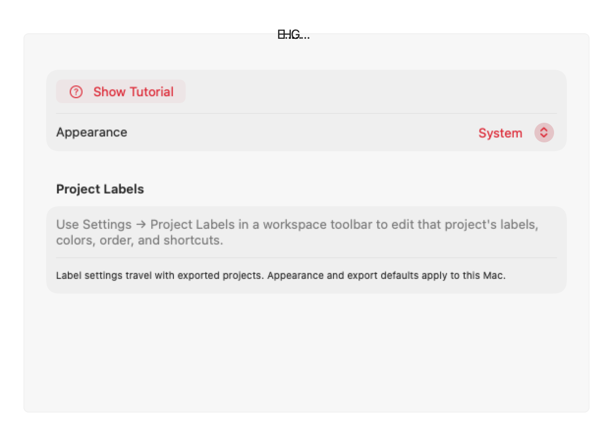

# Mac 유료 다운로드 출시 검증

## 배포 모델

1.0.1 (20260923)부터 Mac 앱은 App Store에서 최초 다운로드 시 결제합니다.
앱 내부의 StoreKit 상품 조회·구매·복원과 무료 체험 제한은 제거합니다.
iPhone 및 Apple Watch companion 앱은 별도 무료 앱으로 유지합니다.

- 프로젝트 수, 녹화 편집 수, CSV/Create ML 내보내기 횟수를 제한하지 않습니다.
- 기존 녹화, 프로젝트, 라벨 파일은 그대로 사용합니다.
- 이전 체험 Keychain 항목은 읽거나 삭제하지 않습니다. 잔존 여부와 무관하게 편집할 수 있습니다.
- 상품 ID나 StoreKit 테스트 구성은 필요하지 않습니다.
- Mac 앱 판매 가격과 판매 지역은 App Store Connect에서 관리합니다.

## 검증

- Mac Release 빌드와 서명 아카이브에서 1.0.1 / 20260923을 확인합니다.
- 설정과 툴바에 Full Unlock, Manage Purchase, Restore Purchases가 없는지 확인합니다.
- 4개 이상 녹화와 여러 프로젝트의 편집·라벨 저장에 체험 제한이 없는지 확인합니다.
- CSV/Create ML 내보내기는 반복할 수 있고, 취소·실패 뒤 다시 실행할 수 있어야 합니다.
- 데이터셋 내보내기 중복 실행 방지와 프로젝트 파일 검증은 유지합니다.
- `Tests/run-release-ui-smoke.sh`, `Tests/run-project-settings-smoke.sh`,
  `Tests/run-auto-segment-smoke.sh`, `Tests/run-chart-interaction-smoke.sh`로 관련 회귀를 확인합니다.

## 심사 제출

앱 설명·프로모션·심사 메모의 무료 다운로드/체험/인앱결제 문구를 유료 다운로드 모델로 갱신합니다.
2.1(b) 답변에 인앱결제 제거 사실을 설명하고 새 빌드를 선택한 뒤 최종 심사 대기 상태를 확인합니다.
빌드 통과와 실제 App Store 결제·Apple 심사 승인은 별도 결과입니다.

## 2026-09-23 로컬 검증 결과

- Xcode 27.0 (27A266a), 기존 Swift 5 언어 모드, macOS 15 지원 유지.
- `DEVELOPER_DIR=/Applications/Xcode.app/Contents/Developer xcodebuild -project JeonstarLab.xcodeproj -scheme 'JeonstarLab Mac' -configuration Release -destination 'generic/platform=macOS' -derivedDataPath /private/tmp/jeonster-paid-20260923/DerivedData CODE_SIGNING_ALLOWED=NO build` 통과.
- 위 4개 회귀 스크립트를 `bash`로 실행해 모두 통과.
- 앱의 설정 뷰를 `NSHostingView`로 오프스크린 렌더해 결제 섹션 제거 확인.
  창을 표시하거나 사용자 입력을 조작하지 않았으며, 실제 App Store 설치 검증은 아님.

